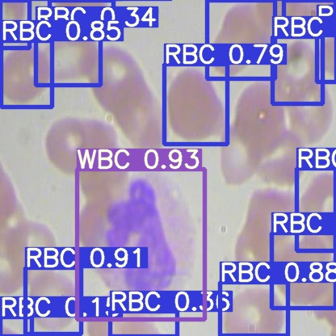
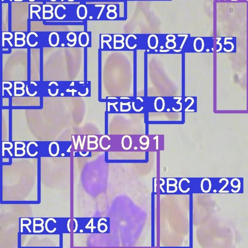
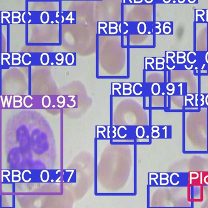
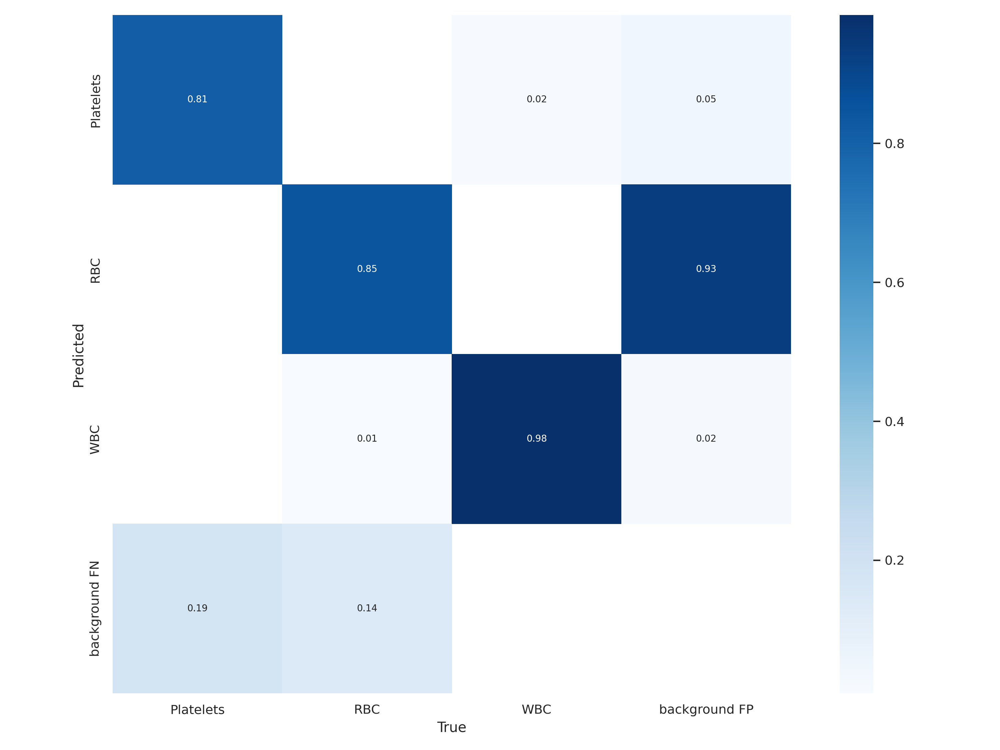
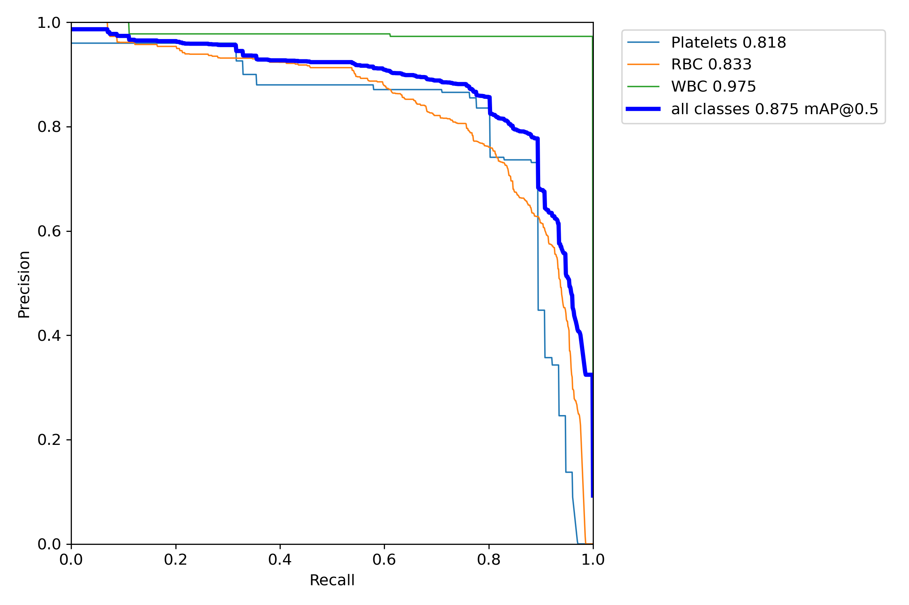
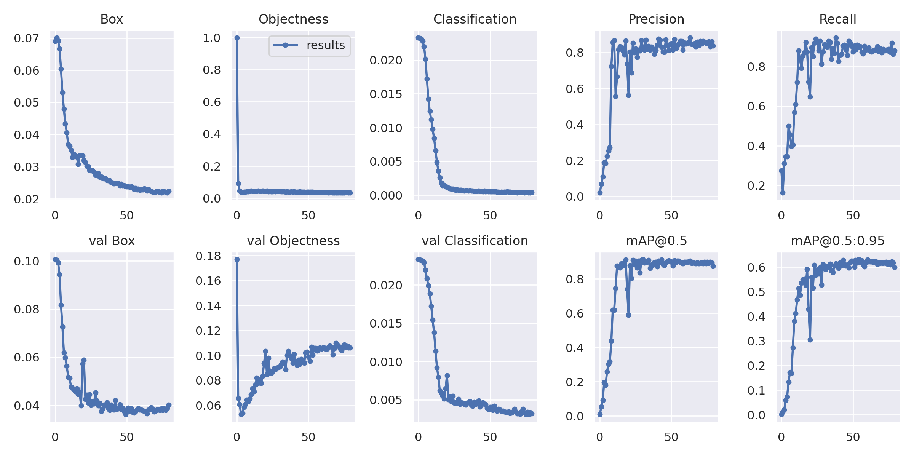

# Training YOLOV7 on Custom Datasets
In this approach i used roboflow datasets exporting to get the dataset from it and convert it into yolov7 format.

 

## **How to use**
You just have to open the "Training YOLOv7 on BCCD Dataset.ipynb" file and begin to work with it with the instruction in the notebook. (You can use colab if you dont have local GPU).

 

## **Inference**
In the predict process you can use your saved model weight to run inference:

 

 

## **Evaluation**
You can check the runs/train/exp folder to seee the whole training log process or just use the test.py file to get the training log results:

 

